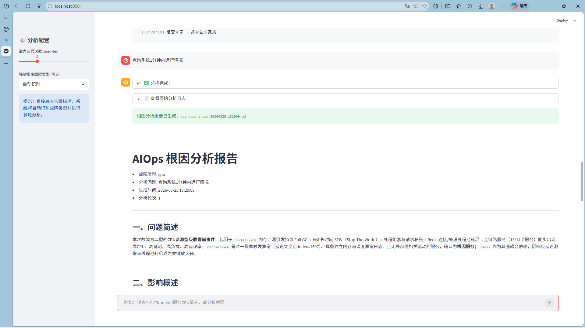

# 基于多智能体的电子元件故障检测系统根因分析

> 毕业设计项目 —— 基于 LangChain + LangGraph 实现 ReAct 模式多智能体协作的 AIOps 根因分析系统

## 一、项目概述

本系统构建了一个基于多智能体协作的 AI 系统最小可行性产品，模拟人类专家团队的协作模式，对 IT 系统中发生的故障进行自动化、智能化的根因分析（RCA）。系统采用 **LangChain + LangGraph** 框架，通过 **ReAct（Reasoning + Acting）** 模式，将大模型的推理能力与外部工具调用能力深度融合，实现对故障问题的动态拆解、迭代验证与逐步收敛。

### 核心

- **多智能体协作**：6 个专业智能体各司其职，协同完成复杂故障诊断
- **ReAct 模式**：交替执行"推理"与"行动"，迭代收敛至高置信度根因
- **工具化数据接入**：将指标、日志、链路追踪、CMDB 封装为可调用工具（模拟 MCP 服务）
- **透明化工作流**：每个智能体的输入、输出及决策依据均被显式记录
- **结构化输出**：生成标准化的事件分析报告

## 二、系统架构

```
┌──────────────────────────────────────────────────────────────────┐
│                        用户输入 / 告警触发                         │
└──────────────────┬───────────────────────────────────────────────┘
                   ▼
┌──────────────────────────────────────────────────────────────────┐
│                     运维专家 Agent (Master)                     │
│              任务规划 · 调度 · 反思 · 调整计划                      │
└──────┬──────────────┬────────────────┬───────────────────────────┘
       ▼              ▼                ▼
┌──────────┐  ┌──────────────┐  ┌───────────────┐
│  指标   │    │  日志       │      │  链路/拓扑   │
│ Agent    │  │ Agent        │  │ Agent         │
│ (Metric) │  │ (Log)        │  │ (Trace)       │
└──────┬───┘  └──────┬───────┘  └───────┬───────┘
       └──────────────┼─────────────────┘
                      ▼
┌──────────────────────────────────────────────────────────────────┐
│                     值班长 Agent (Analyst)                      │
│            证据整合 · 逻辑校验 · 决策仲裁 · 停止判断                 │
└──────────────────┬───────────────────────────────────────────────┘
                   │
          ┌────────┴────────┐
          ▼                 ▼
   [证据不足:继续]     [证据充分:停止]
   回到运维专家              │
                            ▼
┌──────────────────────────────────────────────────────────────────┐
│                     运营专家 Agent (Reporter)                    │
│                    生成结构化事件分析报告                            │
└──────────────────────────────────────────────────────────────────┘
```

## 三、项目结构

```
aiops-rca/
├── main.py                    # 主入口（需要 LLM API Key）
├── demo_offline.py            # 离线演示（无需 API Key）
├── config.py                  # 系统配置
├── .env.example               # 环境变量模板
├── agents/                    # 智能体定义
│   ├── __init__.py
│   ├── master_agent.py        # 运维专家 - 任务规划
│   ├── metric_agent.py        # 指标分析智能体
│   ├── log_agent.py           # 日志分析智能体
│   ├── trace_agent.py         # 链路/拓扑分析智能体
│   ├── analyst_agent.py       # 值班长 - 决策仲裁
│   └── reporter_agent.py      # 运营专家 - 报告生成
├── tools/                     # 工具层（模拟 MCP 服务）
│   ├── __init__.py
│   ├── metric_tools.py        # 指标查询工具
│   ├── log_tools.py           # 日志查询工具
│   ├── trace_tools.py         # 链路追踪工具
│   └── topology_tools.py      # CMDB/拓扑工具
├── workflow/                   # 工作流编排
│   ├── __init__.py
│   └── orchestrator.py        # LangGraph 工作流
├── utils/                     # 工具库
│   ├── __init__.py
│   ├── data_loader.py         # 数据加载
│   └── anomaly_detection.py   # 异常检测算法
├── data/                      # 测试数据（最小演示数据集）   
├── knowledge_base/            # 知识库
│   └── rca_knowledge.md       # RCA 专家知识
├── log/                       # 日志信息 （基于已有报告）
├── bin/                       # 一键部署\运行脚本
└── reports/                   # 生成的报告（自动创建）

```

## 四、快速开始

### 1. 环境准备

安装依赖：

```bash
pip install -r requirements.txt
```

### 2. Web 界面启动（推荐）

双击运行 `run.bat` 或执行：

```bash
streamlit run app.py
```

浏览器自动打开 http://localhost:8501

### 3. 离线演示（无需 API Key）

```bash
python demo_offline.py
```

### 4. 完整多智能体运行（需要 LLM API Key）

```bash
# 运行完整分析
python main.py --fault cpu --query "frontend服务CPU飙升，请分析根因"

# 交互模式
python main.py --interactive
```

## 五、智能体设计

### 5.1 运维专家 Agent（Master）

- **角色**：SRE 运维专家 / 总指挥
- **职责**：解析告警、制定排查计划、调度下游智能体、根据反馈调整策略
- **输出**：结构化的排查步骤计划（JSON 格式）

### 5.2 指标分析 Agent（Metric）

- **角色**：时序数据分析专家
- **工具**：`query_service_metrics`, `query_all_services_overview`, `query_metric_correlation`
- **能力**：Z-Score 异常检测、变化点检测、指标相关性分析

### 5.3 日志分析 Agent（Log）

- **角色**：SLS 日志分析专家
- **工具**：`query_service_logs`, `search_error_patterns`
- **能力**：错误模式提取、异常堆栈分析、日志聚类

### 5.4 链路分析 Agent（Trace）

- **角色**：分布式追踪诊断专家
- **工具**：`query_service_traces`, `analyze_call_chain`, `lookup_service_topology`, `get_full_topology`
- **能力**：调用链分析、故障传播路径识别、拓扑感知

### 5.5 值班长 Agent（Analyst）

- **角色**：决策仲裁者
- **职责**：证据整合、逻辑校验、置信度评估、停止判断
- **原则**：奥卡姆剃刀、依赖拓扑优先、显性化推理

### 5.6 运营专家 Agent（Reporter）

- **角色**：报告生成专家
- **输出**：结构化事件分析报告（问题简述、影响概述、根因分析、优化建议）

## 六、核心技术实现

### 6.1 ReAct 模式

系统采用 ReAct（Reasoning + Acting）模式，交替执行推理与工具调用：

1. **Thought**：基于当前证据生成的假设
2. **Action**：调用对应工具获取新数据
3. **Observation**：分析工具
4. **Repeat**：更新假设，决定是否继续

### 6.2 LangGraph 状态图

使用 LangGraph 构建有状态的工作流图，支持：

- 值班长决定是不是继续/停止
- 各轮分析结果加起来
- 最大迭代控制

## 七、数据集说明

使用 RCAEval 基准数据集（RE1 子集），包含 Online Boutique 微服务系统的5种故障场景：

| 数据文件  | 故障类型 | 描述             |
| --------- | -------- | ---------------- |
| data1.csv | CPU      | CPU 资源耗尽故障 |
| data2.csv | Delay    | 服务延迟异常     |
| data3.csv | Disk     | 磁盘 I/O 异常    |
| data4.csv | Loss     | 网络丢包故障     |
| data5.csv | Memory   | 内存泄漏/OOM     |
|           |          |                  |

每种数据包含 12+ 微服务的 CPU、内存、延迟、流量、错误率等多维指标。

## 八、配置说明

### 关键参数

在 `config.py` 中可调整：

- `z_score_threshold`: 异常检测灵敏度（默认 3.0）
- `max_iterations`: ReAct 最大迭代次数（默认 5）
- `convergence_threshold`: 值班长停止判断阈值（默认 0.8）

## 结果
