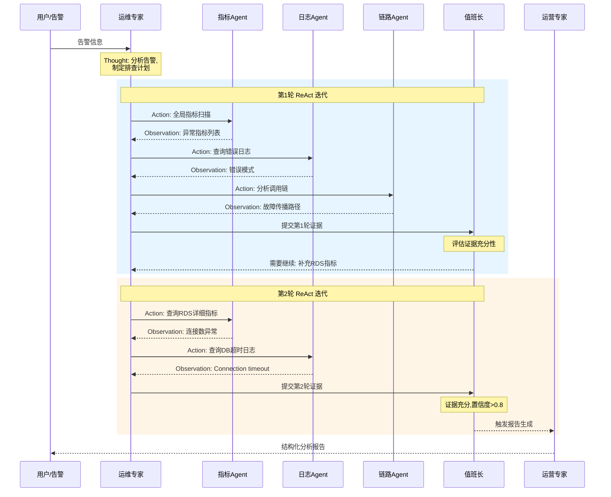

# ReAct 模式时序图

```mermaid
sequenceDiagram
    participant U as 用户/告警
    participant M as 运维专家
    participant MT as 指标Agent
    participant LG as 日志Agent
    participant TR as 链路Agent
    participant A as 值班长
    participant R as 运营专家

    U->>M: 告警信息
    Note over M: Thought: 分析告警,<br/>制定排查计划

    rect rgb(230, 245, 255)
        Note over M,A: 第1轮 ReAct 迭代
        M->>MT: Action: 全局指标扫描
        MT-->>M: Observation: 异常指标列表
        M->>LG: Action: 查询错误日志
        LG-->>M: Observation: 错误模式
        M->>TR: Action: 分析调用链
        TR-->>M: Observation: 故障传播路径
        M->>A: 提交第1轮证据
        Note over A: 评估证据充分性
        A-->>M: 需要继续: 补充RDS指标
    end

    rect rgb(255, 245, 230)
        Note over M,A: 第2轮 ReAct 迭代
        M->>MT: Action: 查询RDS详细指标
        MT-->>M: Observation: 连接数异常
        M->>LG: Action: 查询DB超时日志
        LG-->>M: Observation: Connection timeout
        M->>A: 提交第2轮证据
        Note over A: 证据充分,置信度>0.8
        A-->>R: 触发报告生成
    end

    R-->>U: 结构化分析报告
```
