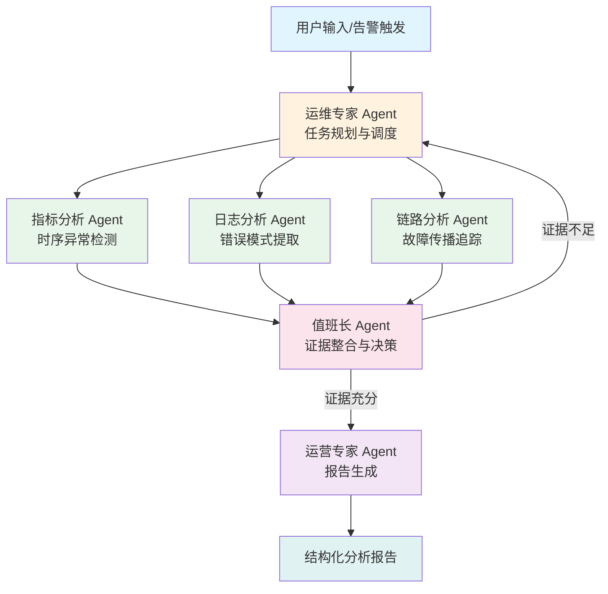

# 多智能体工作流架构图

```mermaid
graph TD
    A[用户输入/告警触发] --> B[运维专家 Agent<br/>任务规划与调度]
    B --> C[指标分析 Agent<br/>时序异常检测]
    B --> D[日志分析 Agent<br/>错误模式提取]
    B --> E[链路分析 Agent<br/>故障传播追踪]
    C --> F[值班长 Agent<br/>证据整合与决策]
    D --> F
    E --> F
    F -->|证据不足| B
    F -->|证据充分| G[运营专家 Agent<br/>报告生成]
    G --> H[结构化分析报告]

    style A fill:#e1f5fe
    style B fill:#fff3e0
    style C fill:#e8f5e9
    style D fill:#e8f5e9
    style E fill:#e8f5e9
    style F fill:#fce4ec
    style G fill:#f3e5f5
    style H fill:#e0f2f1
```